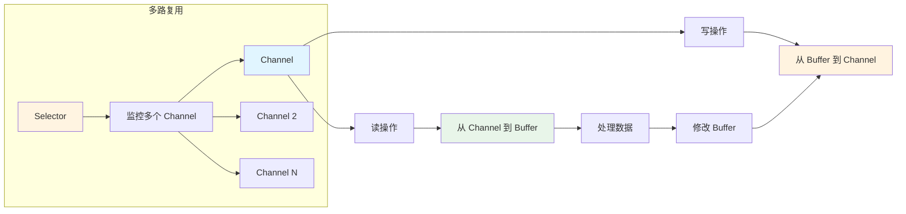
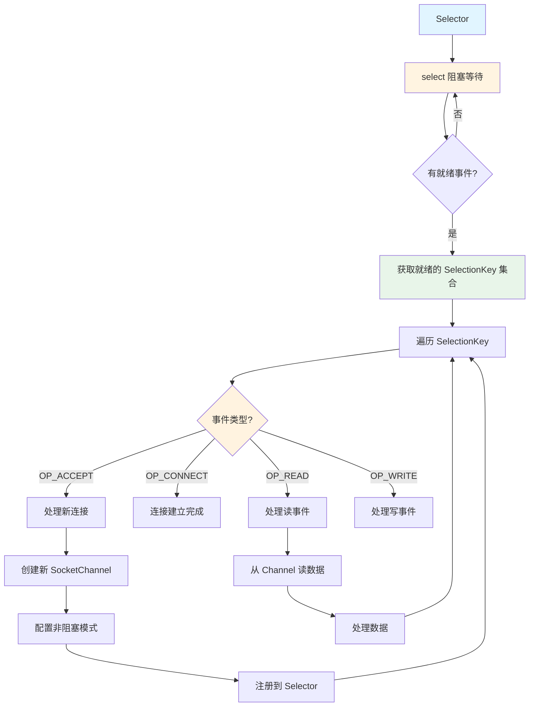

# Java 刷题记录 - 2026年4月1日

> 作者：秋霁
> 学习日期：2026年4月1日

---

## 📚 题库目录

> 💡 [点击这里查看测试代码](TestCode2026-04-01/README.md) - 所有题目的完整可运行代码

| 题号 | 题目 | 测试代码 |
|------|------|---------|
| 1 | [Java 中 for 循环与 foreach 循环的区别是什么](#1-java-中-for-循环与-foreach-循环的区别是什么) | [Question01_ForForeach.java](TestCode2026-04-01/Question01_ForForeach.java) |
| 2 | [Java 中 wait() 和 sleep() 的区别](#2-java-中-wait-和-sleep-的区别) | [Question02_WaitSleep.java](TestCode2026-04-01/Question02_WaitSleep.java) |
| 3 | [Java Object 类中有什么方法，有什么作用](#3-java-object-类中有什么方法有什么作用) | [Question03_ObjectMethods.java](TestCode2026-04-01/Question03_ObjectMethods.java) |

---

## 1. Java 中 for 循环与 foreach 循环的区别是什么

### 📌 回答重点

Java 里的 for 和 foreach 看似都能遍历，但底层机制和适用场景其实有挺大差别。

**核心区别：**

| 特性 | 传统 for 循环 | foreach（增强 for） |
|------|-------------|-------------------|
| 底层机制 | 索引控制 | 迭代器（Iterator）的语法糖 |
| 代码简洁性 | 需要管理下标 | 屏蔽索引细节，更简洁 |
| 访问索引 | ✅ 可以访问索引 | ❌ 无法访问索引 |
| 集合修改 | ✅ 可以修改 | ❌ 不能在遍历时修改集合 |
| 适用场景 | 需要索引或复杂控制 | 简单遍历，代码更安全 |

---

### 💡 面试官最爱问的4个细节

#### 1) 传统 for 循环：靠索引控制

**特点：**
- 需要自己管理下标
- 适合需要访问索引的场景
- 可以反向遍历、跳步等

**代码示例：**

```java
// 基本遍历
for (int i = 0; i < arr.length; i++) {
    System.out.println(arr[i]);
}

// 处理偶数位元素
for (int i = 0; i < arr.length; i += 2) {
    System.out.println("偶数位：" + arr[i]);
}

// 反向遍历
for (int i = arr.length - 1; i >= 0; i--) {
    System.out.println("反向：" + arr[i]);
}

// List 同样适用
List<String> list = new ArrayList<>();
for (int i = 0; i < list.size(); i++) {
    String s = list.get(i);
    // 可以根据索引做特殊处理
    if (i % 2 == 0) {
        System.out.println("偶数索引：" + s);
    }
}
```

**适用场景：**
- 需要访问当前元素的索引
- 需要反向遍历
- 需要跳步遍历（i += 2）
- 需要在遍历时修改集合

---

#### 2) foreach（增强 for）：迭代器的语法糖

**特点：**
- 本质是 Iterator 的语法糖
- 编译后会转成 `Iterator` 的 `hasNext()` 和 `next()` 调用
- 屏蔽索引细节，代码更简洁
- 避免越界错误

**代码示例：**

```java
// 遍历数组
String[] arr = {"A", "B", "C"};
for (String s : arr) {
    System.out.println(s);
}

// 遍历 List
List<String> list = new ArrayList<>();
for (String s : list) {
    System.out.println(s);
}

// 遍历 Set
Set<String> set = new HashSet<>();
for (String s : set) {
    System.out.println(s);
}
```

**编译后的代码（反编译）：**

```java
// foreach 代码
for (String s : list) {
    System.out.println(s);
}

// 编译后实际是这样的
Iterator<String> iterator = list.iterator();
while (iterator.hasNext()) {
    String s = iterator.next();
    System.out.println(s);
}
```

**优点：**
- ✅ 代码简洁，可读性强
- ✅ 不会数组越界
- ✅ 适用于所有 Iterable 集合

**缺点：**
- ❌ 无法访问索引
- ❌ 不能在遍历时删除元素（会抛异常）
- ❌ 不能反向遍历或跳步

---

#### 3) 性能差异分析

**数组类型：**

```java
int[] arr = new int[1000];

// 传统 for
for (int i = 0; i < arr.length; i++) {
    // 直接索引访问，很快
    arr[i] = i;
}

// foreach
for (int num : arr) {
    // 底层也是索引访问，性能基本没差
    System.out.println(num);
}
```

**ArrayList（实现了 RandomAccess 接口）：**

```java
List<Integer> list = new ArrayList<>();

// 传统 for：通过 get(i) 访问
for (int i = 0; i < list.size(); i++) {
    // 时间复杂度：O(1)
    // ArrayList 底层是数组，get(i) 很快
    Integer num = list.get(i);
}

// foreach：迭代器遍历
for (Integer num : list) {
    // 时间复杂度：O(n)
    // 也是 O(n)，但代码更简洁
}
```

**LinkedList（未实现 RandomAccess）：**

```java
List<Integer> linkedList = new LinkedList<>();

// ❌ 传统 for：不推荐！
for (int i = 0; i < linkedList.size(); i++) {
    // 时间复杂度：O(n²)
    // 每次 get(i) 都要从头遍历，性能很差
    Integer num = linkedList.get(i);
}

// ✅ foreach：推荐！
for (Integer num : linkedList) {
    // 时间复杂度：O(n)
    // 使用迭代器，一次遍历完成
}
```

**性能总结：**

| 数据结构 | 传统 for | foreach | 推荐 |
|---------|---------|---------|------|
| 数组 | O(n) | O(n) | 都可以，foreach 更简洁 |
| ArrayList | O(n) | O(n) | foreach 更简洁 |
| LinkedList | O(n²) | O(n) | **必须用 foreach** |
| HashSet/TreeSet | 不支持 | O(n) | 只能用 foreach |

**RandomAccess 接口的作用：**

```java
// 判断是否支持随机访问
if (list instanceof RandomAccess) {
    // ArrayList：可以用传统 for，性能好
    for (int i = 0; i < list.size(); i++) {
        System.out.println(list.get(i));
    }
} else {
    // LinkedList：用 foreach 更好
    for (String s : list) {
        System.out.println(s);
    }
}
```

---

#### 4) foreach 的限制和陷阱

**陷阱1：不能在遍历时删除元素**

```java
List<String> list = new ArrayList<>(Arrays.asList("A", "B", "C"));

// ❌ 错误：foreach 中删除元素
for (String s : list) {
    if (s.equals("B")) {
        list.remove(s);  // ConcurrentModificationException
    }
}

// ✅ 正确：使用迭代器的 remove()
Iterator<String> iterator = list.iterator();
while (iterator.hasNext()) {
    String s = iterator.next();
    if (s.equals("B")) {
        iterator.remove();  // 正确删除
    }
}

// ✅ 正确：使用 removeIf（Java 8+）
list.removeIf(s -> s.equals("B"));
```

**为什么 foreach 删除会抛异常？**

```java
// foreach 底层是迭代器
for (String s : list) {
    if (s.equals("B")) {
        list.remove(s);  // 直接操作集合
    }
}

// 等价于
Iterator<String> iterator = list.iterator();
while (iterator.hasNext()) {
    String s = iterator.next();
    if (s.equals("B")) {
        list.remove(s);  // 调用集合的 remove()
        // 迭代器检测到集合被修改（不是通过迭代器）
        // 下次 hasNext() 或 next() 时抛异常
    }
}
```

**ConcurrentModificationException 的工作原理：**

- 集合维护一个 `modCount` 字段
- 迭代器创建时记录当前的 `modCount`
- 每次调用 `next()` 前检查 `modCount` 是否变化
- 如果变化了，说明集合被修改，抛异常

---

**陷阱2：不能在遍历时修改元素（List）**

```java
List<String> list = new ArrayList<>(Arrays.asList("A", "B", "C"));

// ❌ 错误：foreach 中修改元素
for (String s : list) {
    s = s + " Modified";  // 只修改了局部变量 s
}
// list 内容不变：[A, B, C]

// ✅ 正确：使用索引
for (int i = 0; i < list.size(); i++) {
    list.set(i, list.get(i) + " Modified");
}
// list 内容：[A Modified, B Modified, C Modified]

// ✅ 正确：使用 ListIterator
ListIterator<String> iterator = list.listIterator();
while (iterator.hasNext()) {
    String s = iterator.next();
    iterator.set(s + " Modified");
}
```

---

**陷阱3：不能用于跳步或反向遍历**

```java
int[] arr = {1, 2, 3, 4, 5, 6, 7, 8, 9, 10};

// ❌ foreach 不能跳步
// for (int num : arr) { ... }  // 只能按顺序遍历

// ✅ 传统 for 可以跳步
for (int i = 0; i < arr.length; i += 2) {
    System.out.println(arr[i]);  // 输出：1, 3, 5, 7, 9
}

// ❌ foreach 不能反向
// for (int num : arr) { ... }  // 只能正向

// ✅ 传统 for 可以反向
for (int i = arr.length - 1; i >= 0; i--) {
    System.out.println(arr[i]);  // 输出：10, 9, 8, ..., 1
}
```

---

### 📝 总结

| 特性 | 传统 for | foreach |
|------|---------|---------|
| 索引访问 | ✅ 支持 | ❌ 不支持 |
| 反向遍历 | ✅ 支持 | ❌ 不支持 |
| 跳步遍历 | ✅ 支持 | ❌ 不支持 |
| 修改集合 | ✅ 支持 | ❌ 不支持（需用迭代器） |
| 代码简洁 | ⭐⭐ | ⭐⭐⭐⭐⭐ |
| 性能 | ArrayList: O(n)<br/>LinkedList: O(n²) | 所有集合: O(n) |
| 适用性 | 数组、List | 任意 Iterable |

---

### 🔍 拓展知识：如何选择

#### 选择原则

```
┌─────────────────────────────────────┐
│    需要索引或复杂控制逻辑？          │
└──────────────┬──────────────────────┘
               │
       ┌───────┴───────┐
       │               │
      是              否
       │               │
       ↓               ↓
   传统 for         遍历 List？
       │               │
       │       ┌───────┴───────┐
       │       │               │
       │   ArrayList      LinkedList/其他
       │       │               │
       │   都可以          必须用 foreach
       │       │
       │   推荐用 foreach（代码简洁）
```

#### 实际应用示例

**示例1：统计偶数个数（需要索引）**

```java
int[] nums = {1, 2, 3, 4, 5, 6, 7, 8, 9, 10};
int count = 0;

// 传统 for
for (int i = 0; i < nums.length; i++) {
    if (nums[i] % 2 == 0) {
        count++;
        System.out.println("偶数在索引：" + i);
    }
}

// foreach：无法知道索引
for (int num : nums) {
    if (num % 2 == 0) {
        count++;
        // 无法输出索引
    }
}
```

**示例2：删除满足条件的元素**

```java
List<String> list = new ArrayList<>(Arrays.asList("A", "B", "C", "D"));

// ❌ 错误：foreach 删除
for (String s : list) {
    if (s.equals("B")) {
        list.remove(s);  // ConcurrentModificationException
    }
}

// ✅ 正确：removeIf（Java 8+）
list.removeIf(s -> s.equals("B"));

// ✅ 正确：迭代器
Iterator<String> iterator = list.iterator();
while (iterator.hasNext()) {
    String s = iterator.next();
    if (s.equals("B")) {
        iterator.remove();
    }
}
```

**示例3：遍历 Map**

```java
Map<String, Integer> map = new HashMap<>();
map.put("A", 1);
map.put("B", 2);
map.put("C", 3);

// 方式1：遍历键值对（推荐）
for (Map.Entry<String, Integer> entry : map.entrySet()) {
    String key = entry.getKey();
    Integer value = entry.getValue();
    System.out.println(key + " = " + value);
}

// 方式2：遍历键
for (String key : map.keySet()) {
    Integer value = map.get(key);
    System.out.println(key + " = " + value);
}

// 方式3：遍历值
for (Integer value : map.values()) {
    System.out.println(value);
}
```

---

### ⚠️ 最佳实践

```java
// 1. 简单遍历，优先用 foreach
for (String s : list) {
    System.out.println(s);
}

// 2. 需要索引，用传统 for
for (int i = 0; i < list.size(); i++) {
    System.out.println(i + ": " + list.get(i));
}

// 3. 需要删除元素，用 removeIf 或迭代器
list.removeIf(s -> s.length() > 5);

// 4. LinkedList 必须用 foreach
for (String s : linkedList) {
    System.out.println(s);
}

// 5. 判断是否支持随机访问
if (list instanceof RandomAccess) {
    // 可以用传统 for
    for (int i = 0; i < list.size(); i++) {
        System.out.println(list.get(i));
    }
} else {
    // 用 foreach
    for (String s : list) {
        System.out.println(s);
    }
}
```

---

### 🎯 记忆口诀

> **能 foreach 就 foreach，代码简洁又安全**
> **需要索引用 for，性能 LinkedList 选 foreach**
> **删除元素用迭代器，或者直接 removeIf**

---

## 2. Java 中 wait() 和 sleep() 的区别

### 📌 回答重点

`wait()` 和 `sleep()` 看起来都是让线程"停下来"，但它们的使用场景和底层机制完全不同。

**核心区别：**

| 特性 | wait() | sleep() |
|------|--------|---------|
| 所属类 | `Object` 类的方法 | `Thread` 类的静态方法 |
| 锁的释放 | ✅ 释放锁 | ❌ 不释放锁 |
| 使用位置 | 必须在 synchronized 块中 | 任意位置 |
| 唤醒方式 | 被 `notify()` 或 `notifyAll()` 唤醒 | 时间到了自动唤醒 |
| 中断处理 | 需要捕获 `InterruptedException` | 需要捕获 `InterruptedException` |
| 使用场景 | 线程间协作（生产者-消费者） | 简单暂停线程 |

---

### 💡 面试官最爱问的4个细节

#### 1) wait()：线程间协作机制

**特点：**
- `wait()` 是 `Object` 类的方法
- 调用后会释放持有的监视器锁（monitor lock）
- 进入等待队列，等待其他线程唤醒
- 必须在 `synchronized` 块或方法中使用

**代码示例：**

```java
public class WaitExample {
    private static final Object lock = new Object();
    
    public static void main(String[] args) {
        // 线程1：等待
        Thread thread1 = new Thread(() -> {
            synchronized (lock) {
                System.out.println("线程1：获取锁，准备等待...");
                try {
                    lock.wait();  // 释放锁，进入等待队列
                    System.out.println("线程1：被唤醒了！");
                } catch (InterruptedException e) {
                    Thread.currentThread().interrupt();
                }
                System.out.println("线程1：继续执行");
            }
        });
        
        // 线程2：唤醒
        Thread thread2 = new Thread(() -> {
            try {
                Thread.sleep(1000);  // 先休眠1秒
            } catch (InterruptedException e) {
                e.printStackTrace();
            }
            synchronized (lock) {
                System.out.println("线程2：获取锁，准备唤醒...");
                lock.notify();  // 唤醒等待队列中的一个线程
                System.out.println("线程2：已发送唤醒信号");
            }
        });
        
        thread1.start();
        thread2.start();
    }
}
```

**输出：**
```
线程1：获取锁，准备等待...
线程2：获取锁，准备唤醒...
线程2：已发送唤醒信号
线程1：被唤醒了！
线程1：继续执行
```

**关键点：**
- `wait()` 释放锁，其他线程可以获取锁
- `notify()` 唤醒一个等待的线程
- 被唤醒的线程需要重新获取锁才能继续执行

---

#### 2) sleep()：简单的线程暂停

**特点：**
- `sleep()` 是 `Thread` 类的静态方法
- 只是让当前线程暂停指定时间
- 不释放任何锁
- 时间到了自动进入就绪状态

**代码示例：**

```java
public class SleepExample {
    private static final Object lock = new Object();
    
    public static void main(String[] args) {
        // 线程1：持有锁并休眠
        Thread thread1 = new Thread(() -> {
            synchronized (lock) {
                System.out.println("线程1：获取锁，准备休眠...");
                try {
                    Thread.sleep(2000);  // 休眠2秒，但不释放锁
                    System.out.println("线程1：休眠结束，继续执行");
                } catch (InterruptedException e) {
                    Thread.currentThread().interrupt();
                }
            }
            System.out.println("线程1：释放锁");
        });
        
        // 线程2：等待获取锁
        Thread thread2 = new Thread(() -> {
            synchronized (lock) {
                System.out.println("线程2：获取锁了！");
            }
        });
        
        thread1.start();
        thread2.start();
    }
}
```

**输出：**
```
线程1：获取锁，准备休眠...
线程1：休眠结束，继续执行
线程1：释放锁
线程2：获取锁了！
```

**关键点：**
- `sleep()` 不释放锁
- 线程2必须等待线程1休眠结束并释放锁
- 适用于简单的暂停，不需要线程协作

---

#### 3) wait() 与 sleep() 的详细对比

**代码对比：**

```java
public class WaitSleepComparison {
    private static final Object lock = new Object();
    
    public static void main(String[] args) throws InterruptedException {
        // wait() 示例
        System.out.println("===== wait() 示例 =====");
        synchronized (lock) {
            System.out.println("1. 获取锁");
            try {
                lock.wait(1000);  // 等待1秒或被唤醒
                System.out.println("4. 被唤醒或超时，重新获取锁");
            } catch (InterruptedException e) {
                Thread.currentThread().interrupt();
            }
            System.out.println("5. 执行完毕，释放锁");
        }
        
        // sleep() 示例
        System.out.println("\n===== sleep() 示例 =====");
        synchronized (lock) {
            System.out.println("1. 获取锁");
            try {
                Thread.sleep(1000);  // 休眠1秒
                System.out.println("2. 休眠结束，继续持有锁");
            } catch (InterruptedException e) {
                Thread.currentThread().interrupt();
            }
            System.out.println("3. 执行完毕，释放锁");
        }
    }
}
```

**wait() 流程：**
```
1. 获取锁
2. 调用 wait()
3. 释放锁，进入等待队列
4. 等待被唤醒或超时
5. 被唤醒后重新获取锁
6. 继续执行
```

**sleep() 流程：**
```
1. 获取锁
2. 调用 sleep()
3. 保持锁，线程休眠
4. 休眠结束
5. 继续执行
6. 释放锁
```

---

#### 4) 实际应用场景

**场景1：生产者-消费者模式（用 wait/notify）**

```java
import java.util.LinkedList;
import java.util.Queue;

public class ProducerConsumer {
    private static final int MAX_SIZE = 5;
    private final Queue<Integer> queue = new LinkedList<>();
    
    // 生产者
    public void produce(int value) throws InterruptedException {
        synchronized (queue) {
            // 队列满时等待
            while (queue.size() >= MAX_SIZE) {
                System.out.println("队列已满，生产者等待...");
                queue.wait();
            }
            
            queue.add(value);
            System.out.println("生产: " + value + "，队列大小: " + queue.size());
            queue.notifyAll();  // 唤醒消费者
        }
    }
    
    // 消费者
    public void consume() throws InterruptedException {
        synchronized (queue) {
            // 队列空时等待
            while (queue.isEmpty()) {
                System.out.println("队列为空，消费者等待...");
                queue.wait();
            }
            
            int value = queue.poll();
            System.out.println("消费: " + value + "，队列大小: " + queue.size());
            queue.notifyAll();  // 唤醒生产者
        }
    }
    
    public static void main(String[] args) {
        ProducerConsumer pc = new ProducerConsumer();
        
        // 生产者线程
        Thread producer = new Thread(() -> {
            for (int i = 1; i <= 10; i++) {
                try {
                    pc.produce(i);
                    Thread.sleep(100);  // 模拟生产耗时
                } catch (InterruptedException e) {
                    Thread.currentThread().interrupt();
                }
            }
        });
        
        // 消费者线程
        Thread consumer = new Thread(() -> {
            for (int i = 1; i <= 10; i++) {
                try {
                    pc.consume();
                    Thread.sleep(200);  // 模拟消费耗时
                } catch (InterruptedException e) {
                    Thread.currentThread().interrupt();
                }
            }
        });
        
        producer.start();
        consumer.start();
    }
}
```

**场景2：简单延时（用 sleep）**

```java
public class SimpleDelay {
    public static void main(String[] args) {
        System.out.println("开始执行...");
        
        // 简单延时2秒
        try {
            System.out.println("暂停2秒...");
            Thread.sleep(2000);
        } catch (InterruptedException e) {
            Thread.currentThread().interrupt();
            System.out.println("休眠被中断");
        }
        
        System.out.println("继续执行...");
        
        // 定时任务示例
        for (int i = 1; i <= 5; i++) {
            System.out.println("执行第 " + i + " 次任务");
            try {
                Thread.sleep(1000);  // 每次间隔1秒
            } catch (InterruptedException e) {
                Thread.currentThread().interrupt();
                break;
            }
        }
    }
}
```

---

### 📝 总结

| 特性 | wait() | sleep() |
|------|--------|---------|
| 所属类 | `Object` | `Thread` |
| 调用方式 | `obj.wait()` | `Thread.sleep()` |
| 锁的释放 | ✅ 释放锁 | ❌ 不释放锁 |
| 必须在 synchronized 中 | ✅ 是 | ❌ 否 |
| 唤醒方式 | `notify()` / `notifyAll()` | 时间到自动唤醒 |
| 使用场景 | 线程间协作 | 简单暂停 |
| 典型应用 | 生产者-消费者 | 定时任务、延时 |

---

### 🔍 拓展知识：常见陷阱

#### 陷阱1：wait() 必须在 synchronized 块中

```java
public class WaitTrap {
    private static final Object lock = new Object();
    
    // ❌ 错误：不在 synchronized 块中调用 wait()
    public static void wrongWay() {
        try {
            lock.wait();  // IllegalMonitorStateException
        } catch (InterruptedException e) {
            Thread.currentThread().interrupt();
        }
    }
    
    // ✅ 正确：在 synchronized 块中调用 wait()
    public static void rightWay() {
        synchronized (lock) {
            try {
                lock.wait();
            } catch (InterruptedException e) {
                Thread.currentThread().interrupt();
            }
        }
    }
}
```

---

#### 陷阱2：wait() 被唤醒后需要重新获取锁

```java
public class WaitLockExample {
    private static final Object lock = new Object();
    
    public static void main(String[] args) {
        Thread waitingThread = new Thread(() -> {
            synchronized (lock) {
                System.out.println("等待线程：获取锁");
                try {
                    lock.wait();
                    System.out.println("等待线程：被唤醒，但还没重新获取锁");
                } catch (InterruptedException e) {
                    Thread.currentThread().interrupt();
                }
                System.out.println("等待线程：重新获取锁，继续执行");
            }
        });
        
        Thread notifyingThread = new Thread(() -> {
            try {
                Thread.sleep(1000);
            } catch (InterruptedException e) {
                e.printStackTrace();
            }
            synchronized (lock) {
                System.out.println("通知线程：获取锁");
                lock.notify();  // 发送唤醒信号
                System.out.println("通知线程：继续持有锁，做其他事情...");
                try {
                    Thread.sleep(1000);  // 持有锁1秒
                } catch (InterruptedException e) {
                    e.printStackTrace();
                }
                System.out.println("通知线程：释放锁");
            }
        });
        
        waitingThread.start();
        notifyingThread.start();
    }
}
```

**输出：**
```
等待线程：获取锁
通知线程：获取锁
通知线程：继续持有锁，做其他事情...
通知线程：释放锁
等待线程：被唤醒，但还没重新获取锁
等待线程：重新获取锁，继续执行
```

**说明：** 被唤醒的线程必须等待通知线程释放锁后才能继续执行。

---

#### 陷阱3：notify() vs notifyAll()

```java
public class NotifyExample {
    private static final Object lock = new Object();
    
    public static void main(String[] args) {
        // 创建多个等待线程
        for (int i = 1; i <= 3; i++) {
            final int id = i;
            Thread thread = new Thread(() -> {
                synchronized (lock) {
                    System.out.println("线程" + id + "：开始等待");
                    try {
                        lock.wait();
                        System.out.println("线程" + id + "：被唤醒！");
                    } catch (InterruptedException e) {
                        Thread.currentThread().interrupt();
                    }
                }
            });
            thread.start();
        }
        
        try {
            Thread.sleep(1000);
        } catch (InterruptedException e) {
            e.printStackTrace();
        }
        
        synchronized (lock) {
            System.out.println("\n主线程：发送唤醒信号");
            // lock.notify();  // 只唤醒一个线程
            lock.notifyAll();  // 唤醒所有线程
        }
    }
}
```

**区别：**
- `notify()`：唤醒等待队列中的一个线程（随机）
- `notifyAll()`：唤醒等待队列中的所有线程
- 推荐：一般使用 `notifyAll()` 更安全

---

### ⚠️ 最佳实践

```java
// 1. 使用 wait/notify 实现线程协作
synchronized (lock) {
    while (condition) {  // 使用 while 而非 if
        lock.wait();
    }
    // 执行业务逻辑
}

// 2. 使用 sleep 实现简单延时
try {
    Thread.sleep(1000);  // 暂停1秒
} catch (InterruptedException e) {
    Thread.currentThread().interrupt();
}

// 3. 捕获中断异常后恢复中断状态
try {
    Thread.sleep(1000);
} catch (InterruptedException e) {
    Thread.currentThread().interrupt();  // 恢复中断状态
}

// 4. 使用 wait(long timeout) 设置超时
synchronized (lock) {
    lock.wait(5000);  // 最多等待5秒
}
```

---

### 🎯 记忆口诀

> **wait 要释放锁，配合 notify 协作强**
> **sleep 不释放锁，简单暂停用它帮**
> **线程协作用 wait，定时任务用 sleep**
> **wait 必须在同步块，sleep 随处都能放**

---

## 3. Java Object 类中有什么方法，有什么作用

### 📌 回答重点

每个 Java 类都默认继承 Object，它提供的方法是 JVM 和语言层面协作的结果。这些方法构成了对象行为的基础，像 `equals`、`hashCode` 这种在集合类里天天用。

**Object 类的核心方法：**

| 方法 | 作用 | 是否可重写 |
|------|------|-----------|
| `equals(Object obj)` | 判断两个对象是否逻辑相等 | ✅ 可重写 |
| `hashCode()` | 返回对象的哈希码 | ✅ 可重写 |
| `toString()` | 返回对象的字符串表示 | ✅ 可重写 |
| `clone()` | 创建并返回对象的拷贝 | ✅ 可重写 |
| `getClass()` | 返回运行时类对象 | ❌ final 方法 |
| `wait()` / `notify()` / `notifyAll()` | 线程间通信 | ✅ 可重写（但不推荐） |
| `finalize()` | 对象被回收前可能调用 | ✅ 可重写（已废弃） |

---

### 💡 面试官最爱问的7个方法

#### 1) equals(Object obj) - 判断对象是否相等

**作用：** 判断两个对象是否逻辑相等

**默认实现：** 使用 `==` 比较，比较的是对象地址

**需要满足的契约（Java 规范）：**

| 特性 | 说明 | 示例 |
|------|------|------|
| 自反性 | x.equals(x) 必须为 true | `a.equals(a)` → true |
| 对称性 | x.equals(y) 等于 y.equals(x) | `a.equals(b)` = `b.equals(a)` |
| 传递性 | x.equals(y) && y.equals(z) → x.equals(z) | 级联相等 |
| 一致性 | 多次调用结果一致 | 除非对象修改 |
| 非空性 | 任何非空对象不等于 null | `a.equals(null)` → false |

**代码示例：**

```java
// 默认实现：比较地址
Object obj1 = new Object();
Object obj2 = new Object();
System.out.println(obj1.equals(obj2));  // false（地址不同）

// 重写 equals：按值比较
class Person {
    private String name;
    private int age;
    
    public Person(String name, int age) {
        this.name = name;
        this.age = age;
    }
    
    @Override
    public boolean equals(Object obj) {
        if (this == obj) return true;  // 自反性
        if (obj == null || getClass() != obj.getClass()) return false;
        Person person = (Person) obj;
        return age == person.age && Objects.equals(name, person.name);
    }
}

Person p1 = new Person("张三", 25);
Person p2 = new Person("张三", 25);
System.out.println(p1.equals(p2));  // true（值相同）
```

**String 的 equals 实现：**

```java
// String 已重写 equals，按内容比较
String s1 = new String("Hello");
String s2 = new String("Hello");
System.out.println(s1.equals(s2));  // true（内容相同）
System.out.println(s1 == s2);        // false（地址不同）
```

**注意事项：**
- 重写 `equals` 时必须重写 `hashCode`
- 使用 `Objects.equals(a, b)` 避免空指针
- 使用 `Objects.hash()` 生成哈希码

---

#### 2) hashCode() - 返回对象的哈希码

**作用：** 返回对象的哈希码，用于 HashMap、HashSet 等散列表定位桶位置

**默认实现：** 根据对象地址计算哈希码（native 方法）

**重要规则：**
1. **相等的对象必须有相同的哈希码**（equals 为 true，hashCode 必须相同）
2. **哈希码相同，对象不一定相等**（哈希冲突）

**代码示例：**

```java
// 默认 hashCode：基于地址
Object obj1 = new Object();
Object obj2 = new Object();
System.out.println(obj1.hashCode());  // 随机值
System.out.println(obj2.hashCode());  // 随机值（不同）

// 重写 hashCode：基于内容
class Person {
    private String name;
    private int age;
    
    @Override
    public boolean equals(Object obj) {
        if (this == obj) return true;
        if (obj == null || getClass() != obj.getClass()) return false;
        Person person = (Person) obj;
        return age == person.age && Objects.equals(name, person.name);
    }
    
    @Override
    public int hashCode() {
        return Objects.hash(name, age);
    }
}

Person p1 = new Person("张三", 25);
Person p2 = new Person("张三", 25);
System.out.println(p1.equals(p2));        // true
System.out.println(p1.hashCode() == p2.hashCode());  // true
```

**为什么重写 equals 必须重写 hashCode？**

```java
class Student {
    private String id;
    
    public Student(String id) {
        this.id = id;
    }
    
    // 只重写 equals，没重写 hashCode
    @Override
    public boolean equals(Object obj) {
        if (this == obj) return true;
        if (obj == null || getClass() != obj.getClass()) return false;
        Student student = (Student) obj;
        return Objects.equals(id, student.id);
    }
}

// 问题：无法从 HashMap 中获取对象
Map<Student, String> map = new HashMap<>();
Student s1 = new Student("001");
Student s2 = new Student("001");

map.put(s1, "张三");
System.out.println(map.containsKey(s2));  // false！（找不到）
System.out.println(map.get(s2));         // null

// 原因：s1 和 s2 的 hashCode 不同，存储在不同桶中
System.out.println(s1.hashCode());
System.out.println(s2.hashCode());
```

**正确的做法：**

```java
class Student {
    private String id;
    
    @Override
    public boolean equals(Object obj) {
        if (this == obj) return true;
        if (obj == null || getClass() != obj.getClass()) return false;
        Student student = (Student) obj;
        return Objects.equals(id, student.id);
    }
    
    @Override
    public int hashCode() {
        return Objects.hash(id);  // 相同的 id 生成相同的 hashCode
    }
}

// 现在可以正常使用 HashMap
Map<Student, String> map = new HashMap<>();
Student s1 = new Student("001");
Student s2 = new Student("001");

map.put(s1, "张三");
System.out.println(map.containsKey(s2));  // true
System.out.println(map.get(s2));         // 张三
```

---

#### 3) toString() - 返回对象的字符串表示

**作用：** 返回对象的字符串表示，打印对象或字符串拼接时自动调用

**默认实现：** `getClass().getName() + '@' + Integer.toHexString(hashCode())`

**示例：**

```java
// 默认 toString：输出地址
Object obj = new Object();
System.out.println(obj);  // java.lang.Object@6504e311

// 重写 toString：输出有用信息
class Person {
    private String name;
    private int age;
    
    public Person(String name, int age) {
        this.name = name;
        this.age = age;
    }
    
    @Override
    public String toString() {
        return "Person{name='" + name + "', age=" + age + "}";
    }
}

Person person = new Person("张三", 25);
System.out.println(person);  // Person{name='张三', age=25}

// 字符串拼接
String msg = "用户信息：" + person;
System.out.println(msg);  // 用户信息：Person{name='张三', age=25}
```

**最佳实践：**

```java
// 使用 StringBuilder 构建（避免字符串拼接）
@Override
public String toString() {
    return new StringBuilder()
        .append("Person{")
        .append("name='").append(name).append('\'')
        .append(", age=").append(age)
        .append('}')
        .toString();
}

// 或者使用格式化字符串
@Override
public String toString() {
    return String.format("Person{name='%s', age=%d}", name, age);
}
```

---

#### 4) clone() - 创建对象的拷贝

**作用：** 创建并返回对象的拷贝

**使用条件：**
1. 实现 `Cloneable` 接口（标记接口）
2. 重写 `clone()` 方法，调用 `super.clone()`
3. 处理 `CloneNotSupportedException`

**浅拷贝 vs 深拷贝：**

```java
// 浅拷贝：只复制基本类型和引用地址
class ShallowCopyExample implements Cloneable {
    private int id;
    private String name;
    private int[] scores;  // 引用类型
    
    public ShallowCopyExample(int id, String name, int[] scores) {
        this.id = id;
        this.name = name;
        this.scores = scores;
    }
    
    @Override
    protected Object clone() throws CloneNotSupportedException {
        return super.clone();  // 浅拷贝
    }
}

ShallowCopyExample original = new ShallowCopyExample(1, "张三", new int[]{90, 85, 95});
ShallowCopyExample copy = (ShallowCopyExample) original.clone();

// 修改拷贝对象的数组
copy.getScores()[0] = 100;

// 原对象也被影响了（浅拷贝）
System.out.println(Arrays.toString(original.getScores()));  // [100, 85, 95]
```

```java
// 深拷贝：递归复制引用类型
class DeepCopyExample implements Cloneable {
    private int id;
    private String name;
    private int[] scores;
    
    public DeepCopyExample(int id, String name, int[] scores) {
        this.id = id;
        this.name = name;
        this.scores = scores;
    }
    
    @Override
    protected Object clone() throws CloneNotSupportedException {
        DeepCopyExample copy = (DeepCopyExample) super.clone();
        copy.scores = scores.clone();  // 深拷贝数组
        return copy;
    }
}

DeepCopyExample original = new DeepCopyExample(1, "张三", new int[]{90, 85, 95});
DeepCopyExample copy = (DeepCopyExample) original.clone();

// 修改拷贝对象的数组
copy.getScores()[0] = 100;

// 原对象不受影响（深拷贝）
System.out.println(Arrays.toString(original.getScores()));  // [90, 85, 95]
System.out.println(Arrays.toString(copy.getScores()));      // [100, 85, 95]
```

**注意事项：**
- `clone()` 是 protected 方法，只能在类内部或子类调用
- String 等不可变类不需要深拷贝
- 推荐使用拷贝构造器或工厂方法替代 clone

---

#### 5) getClass() - 返回运行时类对象

**作用：** 返回对象的运行时类对象（Class 对象）

**特点：** final 方法，不能被重写

**代码示例：**

```java
Object obj = new String("Hello");
Class<?> clazz = obj.getClass();
System.out.println(clazz.getName());      // java.lang.String
System.out.println(clazz.getSimpleName()); // String

// 获取类的各种信息
System.out.println(clazz.getPackage());   // package java.lang
System.out.println(clazz.getSuperclass()); // class java.lang.Object
System.out.println(clazz.getInterfaces()); // [interface java.io.Serializable...]

// 反射入口
try {
    // 通过类名获取 Class 对象
    Class<?> strClass = Class.forName("java.lang.String");
    
    // 创建实例
    Object instance = strClass.getDeclaredConstructor().newInstance();
    
    // 获取方法
    Method method = strClass.getMethod("length");
    int length = (int) method.invoke("Hello");
    System.out.println(length);  // 5
} catch (Exception e) {
    e.printStackTrace();
}
```

**应用场景：**
- 反射编程
- 动态加载类
- 获取类信息
- 框架开发

---

#### 6) wait() / notify() / notifyAll() - 线程间通信

**作用：** 配合 synchronized 实现线程间通信

**特点：**
- `wait()`：释放锁并挂起线程，直到被唤醒
- `notify()`：唤醒等待队列中的一个线程
- `notifyAll()`：唤醒等待队列中的所有线程
- 必须在 synchronized 块中使用

**代码示例：**

```java
public class WaitNotifyExample {
    private static final Object lock = new Object();
    private static boolean ready = false;
    
    public static void main(String[] args) {
        Thread producer = new Thread(() -> {
            synchronized (lock) {
                System.out.println("生产者：开始生产...");
                try {
                    Thread.sleep(1000);
                } catch (InterruptedException e) {
                    Thread.currentThread().interrupt();
                }
                ready = true;
                System.out.println("生产者：生产完成，通知消费者");
                lock.notify();  // 唤醒消费者
            }
        });
        
        Thread consumer = new Thread(() -> {
            synchronized (lock) {
                while (!ready) {
                    try {
                        System.out.println("消费者：等待中...");
                        lock.wait();  // 等待生产者唤醒
                    } catch (InterruptedException e) {
                        Thread.currentThread().interrupt();
                    }
                }
                System.out.println("消费者：消费完成");
            }
        });
        
        consumer.start();
        producer.start();
    }
}
```

**输出：**
```
消费者：等待中...
生产者：开始生产...
生产者：生产完成，通知消费者
消费者：消费完成
```

---

#### 7) finalize() - 对象被回收前可能调用的方法

**作用：** 对象被垃圾回收前可能调用的方法

**问题：**
- ❌ 不保证一定会执行
- ❌ 执行时间不确定
- ❌ 性能影响大
- ❌ Java 9 已废弃

**正确做法：**

```java
// ❌ 不推荐：使用 finalize
public class OldStyle {
    @Override
    protected void finalize() throws Throwable {
        try {
            // 关闭资源
        } finally {
            super.finalize();
        }
    }
}

// ✅ 推荐：使用 try-with-resources
public class NewStyle implements AutoCloseable {
    @Override
    public void close() {
        // 关闭资源
    }
}

// 使用
try (NewStyle resource = new NewStyle()) {
    // 使用资源
}  // 自动调用 close()

// ✅ 推荐：手动关闭
Connection conn = DriverManager.getConnection(url);
try {
    // 使用连接
} finally {
    if (conn != null) {
        conn.close();  // 手动关闭
    }
}
```

---

### 📝 总结

| 方法 | 作用 | 必须重写 | 典型应用 |
|------|------|---------|---------|
| `equals()` | 判断对象逻辑相等 | 配合hashCode | 集合查找 |
| `hashCode()` | 返回哈希码 | 配合equals | HashMap、HashSet |
| `toString()` | 字符串表示 | 建议重写 | 调试、日志 |
| `clone()` | 对象拷贝 | 需要深拷贝 | 对象复制 |
| `getClass()` | 获取类对象 | 不可重写 | 反射 |
| `wait/notify` | 线程通信 | 不推荐重写 | 线程协作 |
| `finalize()` | 资源释放 | 已废弃 | 不推荐使用 |

---

### 🔍 拓展知识：常见陷阱

#### 陷阱1：重写 equals 但没重写 hashCode

```java
class Student {
    private String id;
    
    @Override
    public boolean equals(Object obj) {
        // 正确的 equals 实现
        if (this == obj) return true;
        if (obj == null || getClass() != obj.getClass()) return false;
        Student student = (Student) obj;
        return Objects.equals(id, student.id);
    }
    
    // ❌ 忘记重写 hashCode
}

Set<Student> set = new HashSet<>();
Student s1 = new Student("001");
Student s2 = new Student("001");

set.add(s1);
set.add(s2);

System.out.println(set.size());  // 2（应该是1！）
```

**解决方案：**
```java
@Override
public int hashCode() {
    return Objects.hash(id);
}
```

---

#### 陷阱2：equals 参数类型错误

```java
class Person {
    private String name;
    
    // ❌ 错误：参数类型不对
    public boolean equals(Person other) {  // 重载，不是重写
        return this.name.equals(other.name);
    }
}

Person p1 = new Person("张三");
Object p2 = new Person("张三");

System.out.println(p1.equals(p2));  // true（调用自己的 equals）
System.out.println(p1.equals((Object)p2));  // false（调 Object 的 equals）
```

**解决方案：**
```java
@Override
public boolean equals(Object obj) {  // 正确：参数是 Object
    if (this == obj) return true;
    if (obj == null || getClass() != obj.getClass()) return false;
    Person other = (Person) obj;
    return Objects.equals(name, other.name);
}
```

---

#### 陷阱3：equals 违反对称性

```java
class CaseInsensitiveString {
    private String s;
    
    public CaseInsensitiveString(String s) {
        this.s = s;
    }
    
    @Override
    public boolean equals(Object obj) {
        if (obj instanceof CaseInsensitiveString) {
            return s.equalsIgnoreCase(((CaseInsensitiveString) obj).s);
        }
        if (obj instanceof String) {  // ❌ 错误：能和 String 比较
            return s.equalsIgnoreCase((String) obj);
        }
        return false;
    }
}

CaseInsensitiveString cis = new CaseInsensitiveString("Polish");
String s = "polish";

System.out.println(cis.equals(s));  // true
System.out.println(s.equals(cis));  // false！（不对称）
```

**解决方案：**
```java
@Override
public boolean equals(Object obj) {
    return obj instanceof CaseInsensitiveString &&
           ((CaseInsensitiveString) obj).s.equalsIgnoreCase(s);
}
```

---

### ⚠️ 最佳实践

```java
// 1. 使用 Objects 工具类
@Override
public boolean equals(Object obj) {
    if (this == obj) return true;
    if (obj == null || getClass() != obj.getClass()) return false;
    Person person = (Person) obj;
    return age == person.age && Objects.equals(name, person.name);
}

@Override
public int hashCode() {
    return Objects.hash(name, age);
}

// 2. 使用 StringBuilder 构建 toString
@Override
public String toString() {
    return new StringBuilder()
        .append("Person{")
        .append("name='").append(name).append('\'')
        .append(", age=").append(age)
        .append('}')
        .toString();
}

// 3. 使用 try-with-resources 替代 finalize
try (Connection conn = DriverManager.getConnection(url)) {
    // 使用连接
}  // 自动关闭

// 4. 使用拷贝构造器替代 clone
class Person {
    private String name;
    private int age;
    
    // 拷贝构造器
    public Person(Person other) {
        this.name = other.name;
        this.age = other.age;
    }
}

Person original = new Person("张三", 25);
Person copy = new Person(original);  // 深拷贝
```

---

### 🎯 记忆口诀

> **equals 判断逻辑值，hashCode 配合用**
> **toString 重写看内容，clone 深浅要分清**
> **getClass 反射用，wait/notify 线程通**
> **finalize 已废弃，try-with 替代它**

---

---

## 4、什么是 Channel？

### 📌 核心概念

**Channel 是 Java NIO 的核心组件**，可以看作是数据传输的通道，负责从缓冲区读写数据。

**关键特点：**
- **双向通道**：既能读也能写，而传统 IO 流一般是单向的
- **面向缓冲区**：数据总是流向 Buffer，Channel 本身不直接操作数据
- **多路复用**：配合 Selector 实现高并发

### 🔍 常见 Channel 实现

| Channel 类型 | 说明 | 使用场景 |
|-------------|------|----------|
| **FileChannel** | 文件通道 | 文件读写、文件锁、文件映射 |
| **SocketChannel** | TCP 客户端通道 | 客户端网络通信 |
| **ServerSocketChannel** | TCP 服务端通道 | 服务端监听连接 |
| **DatagramChannel** | UDP 通道 | 无连接的网络通信 |

> 💡 **实际应用**：Netty 就基于 NioSocketChannel 做网络通信，用统一的抽象屏蔽底层差异。

### 📊 Channel 工作流程图



### 🔄 Channel 与 Buffer 的交互模式

**读数据流程：**
```java
Channel → Buffer → 程序处理数据
```

**写数据流程：**
```java
程序处理数据 → Buffer → Channel
```

**优势：**
- ✅ 数据处理更灵活
- ✅ 便于零拷贝技术的应用
- ✅ 减少数据拷贝次数

### ⚡ Channel + Selector 多路复用

**传统 IO 模式：**
```
每个连接 → 一个线程 → 阻塞等待
结果：并发连接数 = 线程数（资源消耗大）
```

**NIO 多路复用模式：**
```
一个线程 + Selector → 监控多个 Channel
结果：一个线程处理几万并发连接（常见场景）
```

**事件类型：**
| 事件类型 | 说明 |
|---------|------|
| **OP_ACCEPT** | 有新连接到达（ServerSocketChannel） |
| **OP_CONNECT** | 连接建立完成（SocketChannel） |
| **OP_READ** | 数据可读 |
| **OP_WRITE** | 数据可写 |

### 💻 代码示例

#### 示例1：FileChannel 基本读写

```java
import java.io.*;
import java.nio.*;
import java.nio.channels.*;

// 1. 写文件
RandomAccessFile file = new RandomAccessFile("data.txt", "rw");
FileChannel channel = file.getChannel();

String data = "Hello, NIO Channel!";
ByteBuffer buffer = ByteBuffer.allocate(1024);
buffer.put(data.getBytes());
buffer.flip();  // 切换为读模式

channel.write(buffer);
channel.close();

// 2. 读文件
file = new RandomAccessFile("data.txt", "r");
channel = file.getChannel();

buffer = ByteBuffer.allocate(1024);
channel.read(buffer);
buffer.flip();  // 切换为读模式

System.out.println(new String(buffer.array(), 0, buffer.limit()));
channel.close();
```

#### 示例2：SocketChannel 客户端通信

```java
import java.nio.*;
import java.nio.channels.*;

// 打开 SocketChannel
SocketChannel channel = SocketChannel.open();
channel.configureBlocking(false);  // 配置为非阻塞模式
channel.connect(new InetSocketAddress("localhost", 8080));

while (!channel.finishConnect()) {
    // 等待连接完成
}

// 发送数据
ByteBuffer buffer = ByteBuffer.wrap("Hello Server".getBytes());
channel.write(buffer);

// 接收数据
buffer.clear();
int bytesRead = channel.read(buffer);
buffer.flip();
System.out.println(new String(buffer.array(), 0, bytesRead));

channel.close();
```

#### 示例3：ServerSocketChannel + Selector 多路复用

```java
import java.nio.*;
import java.nio.channels.*;
import java.util.*;

// 打开 ServerSocketChannel
ServerSocketChannel serverChannel = ServerSocketChannel.open();
serverChannel.configureBlocking(false);  // 必须配置为非阻塞模式
serverChannel.bind(new InetSocketAddress(8080));

// 打开 Selector
Selector selector = Selector.open();

// 注册到 Selector，监听 ACCEPT 事件
serverChannel.register(selector, SelectionKey.OP_ACCEPT);

while (true) {
    // 阻塞等待事件
    int readyCount = selector.select();
    
    // 获取所有就绪的 SelectionKey
    Set<SelectionKey> readyKeys = selector.selectedKeys();
    Iterator<SelectionKey> iterator = readyKeys.iterator();
    
    while (iterator.hasNext()) {
        SelectionKey key = iterator.next();
        iterator.remove();
        
        if (key.isAcceptable()) {
            // 处理连接事件
            ServerSocketChannel server = (ServerSocketChannel) key.channel();
            SocketChannel channel = server.accept();
            channel.configureBlocking(false);
            channel.register(selector, SelectionKey.OP_READ);
            
            System.out.println("新连接：" + channel);
            
        } else if (key.isReadable()) {
            // 处理读事件
            SocketChannel channel = (SocketChannel) key.channel();
            ByteBuffer buffer = ByteBuffer.allocate(1024);
            int bytesRead = channel.read(buffer);
            
            if (bytesRead == -1) {
                channel.close();
            } else {
                buffer.flip();
                System.out.println("收到数据：" + 
                    new String(buffer.array(), 0, bytesRead));
            }
        }
    }
}
```

### ⚠️ 注意事项

#### 1️⃣ 非阻塞模式必须配置

```java
// ❌ 错误：未配置非阻塞模式，注册到 Selector 会抛出异常
ServerSocketChannel channel = ServerSocketChannel.open();
channel.register(selector, SelectionKey.OP_ACCEPT);  // 抛出 IllegalBlockingModeException

// ✅ 正确：先配置为非阻塞模式
ServerSocketChannel channel = ServerSocketChannel.open();
channel.configureBlocking(false);  // 配置为非阻塞模式
channel.register(selector, SelectionKey.OP_ACCEPT);  // 正常工作
```

#### 2️⃣ Channel 必须关闭释放资源

```java
FileChannel channel = ...;
try {
    // 使用 channel
} finally {
    channel.close();  // 必须关闭，释放文件描述符
}
```

> ⚠️ **文件描述符资源宝贵**：Linux 下默认最多 1024 个，用完就报 `Too many open files`
>
> 解决方法：
> - 及时关闭 Channel
> - 调优系统参数：`ulimit -n 65535`

#### 3️⃣ Buffer 的 flip() 方法

```java
ByteBuffer buffer = ByteBuffer.allocate(1024);
channel.read(buffer);
// buffer.flip();  // ❌ 忘记 flip，读取的数据会出错
System.out.println(new String(buffer.array(), 0, buffer.limit()));

ByteBuffer buffer = ByteBuffer.allocate(1024);
channel.read(buffer);
buffer.flip();  // ✅ 正确：切换为读模式
System.out.println(new String(buffer.array(), 0, buffer.limit()));
```

### 🎯 最佳实践

#### 1️⃣ 使用 try-with-resources 自动关闭

```java
try (FileChannel channel = FileChannel.open(Paths.get("data.txt"), 
        StandardOpenOption.READ, StandardOpenOption.WRITE)) {
    // 使用 channel
}  // 自动关闭，释放资源
```

#### 2️⃣ 复用 Buffer 减少内存分配

```java
// ❌ 每次读写都创建新 Buffer
for (int i = 0; i < 1000; i++) {
    ByteBuffer buffer = ByteBuffer.allocate(1024);  // 浪费内存
    channel.read(buffer);
}

// ✅ 复用同一个 Buffer
ByteBuffer buffer = ByteBuffer.allocate(1024);
for (int i = 0; i < 1000; i++) {
    buffer.clear();
    channel.read(buffer);
}
```

#### 3️⃣ 使用 Selector 多路复用提升性能

```java
// ✅ 一个 Selector 管理多个 Channel
Selector selector = Selector.open();
serverChannel.register(selector, SelectionKey.OP_ACCEPT);
socketChannel.register(selector, SelectionKey.OP_READ);

while (true) {
    selector.select();  // 一次 select() 处理多个事件
    // 处理所有就绪的 Channel
}
```

### ❌ 常见误区

| 误区 | 说明 |
|------|------|
| **误区1：Channel 可以直接存储数据** | ❌ Channel 本身不存储数据，数据必须通过 Buffer 传输 |
| **误区2：阻塞模式也能注册到 Selector** | ❌ 必须配置为非阻塞模式才能注册到 Selector |
| **误区3：忘记 close Channel** | ❌ 会泄漏文件描述符，导致资源耗尽 |
| **误区4：忘记 flip() Buffer** | ❌ 读写切换时会读取到错误数据 |
| **误区5：一个 Channel 只能注册一次** | ❌ 可以用 `interestOps()` 动态修改注册的事件类型 |

### 🧠 记忆口诀

> **Channel 双向能读写，Buffer 传输是关键**
> **四种 Channel 分场景，File Socket Server UDP**
> **非阻塞配 Selector，多路复用扛并发**
> **记得 flip 切模式，及时关闭不泄漏**

---

---

## 5、什么是 Selector？

### 📌 核心概念

**Selector 是 Java NIO 里用来做事件监听的核心组件**，一个线程通过它就能同时监控多个通道的 I/O 状态，比如有没有数据可读、能不能写入。

**关键特点：**
- **单线程多路复用**：一个线程管理多个 Channel
- **事件驱动**：只处理就绪的 Channel，不轮询所有连接
- **非阻塞前提**：Channel 必须配置为非阻塞模式
- **高效轮询**：底层基于 epoll（Linux）或 kqueue（macOS）

### 🔥 传统 IO vs NIO + Selector

| 对比维度 | 传统 IO | NIO + Selector |
|---------|---------|----------------|
| **线程模型** | 一个连接一个线程 | 一个线程管理多个连接 |
| **并发能力** | 受线程数量限制 | 可处理数万并发连接 |
| **资源消耗** | 线程切换开销大 | 线程复用，开销小 |
| **适用场景** | 连接数少，每个连接处理时间长 | 高并发，短连接或空闲连接多 |

**实际案例：**
- **传统 IO**：1000 个连接需要 1000 个线程 → 系统扛不住
- **NIO + Selector**：1 个线程处理 10000 个连接 → 轻松应对

> 💡 **实际应用**：Netty、Dubbo、RocketMQ 等高性能中间件底层都靠 Selector 撑着。

### 📊 Selector 工作流程图



### 🎯 SelectionKey 与事件类型

每个 Channel 注册到 Selector 时都会绑定一个 **SelectionKey**，表示"我对哪些事件感兴趣"。

#### 事件类型表

| 事件类型 | 常量 | 说明 | 适用场景 |
|---------|------|------|----------|
| **OP_ACCEPT** | 16 | 有新连接到达 | ServerSocketChannel 监听新连接 |
| **OP_CONNECT** | 8 | 连接建立完成 | SocketChannel 客户端连接 |
| **OP_READ** | 1 | 数据可读 | 任意 Channel 接收数据 |
| **OP_WRITE** | 4 | 数据可写 | 任意 Channel 发送数据 |

#### SelectionKey 重要方法

```java
SelectionKey key = channel.register(selector, SelectionKey.OP_READ);

// 判断事件类型
key.isAcceptable();   // 是否有新连接
key.isConnectable();  // 连接是否完成
key.isReadable();     // 是否可读
key.isWritable();     // 是否可写

// 获取关联对象
key.channel();        // 获取对应的 Channel
key.selector();       // 获取对应的 Selector
key.attachment();     // 获取附加对象（可自定义）
```

### 💻 代码示例

#### 示例1：Selector 基本使用

```java
import java.nio.*;
import java.nio.channels.*;
import java.util.*;

// 1. 打开 Selector
Selector selector = Selector.open();

// 2. 配置 Channel 为非阻塞模式
ServerSocketChannel serverChannel = ServerSocketChannel.open();
serverChannel.configureBlocking(false);
serverChannel.bind(new InetSocketAddress(8080));

// 3. 注册到 Selector，监听 ACCEPT 事件
serverChannel.register(selector, SelectionKey.OP_ACCEPT);

// 4. 事件循环
while (true) {
    // 阻塞等待就绪事件（返回就绪的通道数）
    int readyCount = selector.select();
    
    if (readyCount == 0) {
        continue;  // 没有就绪事件
    }
    
    // 5. 获取所有就绪的 SelectionKey
    Set<SelectionKey> readyKeys = selector.selectedKeys();
    Iterator<SelectionKey> iterator = readyKeys.iterator();
    
    // 6. 遍历处理就绪事件
    while (iterator.hasNext()) {
        SelectionKey key = iterator.next();
        iterator.remove();  // 必须移除，避免重复处理
        
        if (key.isAcceptable()) {
            // 处理新连接
            ServerSocketChannel server = (ServerSocketChannel) key.channel();
            SocketChannel channel = server.accept();
            channel.configureBlocking(false);
            channel.register(selector, SelectionKey.OP_READ);
            
        } else if (key.isReadable()) {
            // 处理读事件
            SocketChannel channel = (SocketChannel) key.channel();
            ByteBuffer buffer = ByteBuffer.allocate(1024);
            int bytesRead = channel.read(buffer);
            
            if (bytesRead == -1) {
                channel.close();  // 连接关闭
            } else {
                buffer.flip();
                System.out.println("收到数据：" + 
                    new String(buffer.array(), 0, bytesRead));
            }
        }
    }
}
```

#### 示例2：动态修改感兴趣的事件

```java
// 1. 注册时只监听 OP_READ
SelectionKey key = channel.register(selector, SelectionKey.OP_READ);

// 2. 动态添加 OP_WRITE（需要先获取当前的事件类型）
int newInterestOps = key.interestOps() | SelectionKey.OP_WRITE;
key.interestOps(newInterestOps);

// 3. 取消 OP_WRITE
int removeWriteOps = key.interestOps() & ~SelectionKey.OP_WRITE;
key.interestOps(removeWriteOps);
```

#### 示例3：使用附加对象存储状态

```java
// 注册时附加对象
class ConnectionState {
    private SocketChannel channel;
    private ByteBuffer buffer;
    private String userId;
    // ... 其他状态
}

ConnectionState state = new ConnectionState(channel, buffer, "user001");
SelectionKey key = channel.register(selector, SelectionKey.OP_READ, state);

// 处理事件时获取附加对象
if (key.isReadable()) {
    ConnectionState state = (ConnectionState) key.attachment();
    // 使用 state 处理业务逻辑
}
```

#### 示例4：设置 select() 超时时间

```java
// 无限阻塞等待
selector.select();

// 设置超时（毫秒）
selector.select(1000);  // 最多等待 1 秒

// 非阻塞立即返回
selector.selectNow();  // 立即返回，不会阻塞
```

### ⚠️ 注意事项

#### 1️⃣ 非阻塞模式是前提

```java
// ❌ 错误：阻塞模式无法注册到 Selector
ServerSocketChannel channel = ServerSocketChannel.open();
channel.register(selector, SelectionKey.OP_ACCEPT);  
// 抛出 IllegalBlockingModeException

// ✅ 正确：必须先配置为非阻塞模式
ServerSocketChannel channel = ServerSocketChannel.open();
channel.configureBlocking(false);  // 配置为非阻塞
channel.register(selector, SelectionKey.OP_ACCEPT);  // 正常工作
```

#### 2️⃣ 必须移除已处理的 SelectionKey

```java
// ❌ 错误：不移除 SelectionKey
Set<SelectionKey> readyKeys = selector.selectedKeys();
Iterator<SelectionKey> iterator = readyKeys.iterator();
while (iterator.hasNext()) {
    SelectionKey key = iterator.next();
    // 处理 key，但没有 iterator.remove()
    // 下次循环会重复处理这个 key
}

// ✅ 正确：必须调用 iterator.remove()
Set<SelectionKey> readyKeys = selector.selectedKeys();
Iterator<SelectionKey> iterator = readyKeys.iterator();
while (iterator.hasNext()) {
    SelectionKey key = iterator.next();
    iterator.remove();  // 必须移除
    // 处理 key
}
```

#### 3️⃣ select() 返回的是就绪的通道数

```java
// ❌ 误区：select() 返回所有注册的通道数
int count = selector.select();  
System.out.println("注册的通道数: " + count);  // 错误！

// ✅ 正确：select() 返回就绪的通道数（>= 1）
int readyCount = selector.select();
System.out.println("就绪的通道数: " + readyCount);  // 正确
```

#### 4️⃣ 及时关闭 Channel 和 Selector

```java
try {
    // 使用 Channel 和 Selector
} finally {
    // 关闭所有 Channel
    for (SelectionKey key : selector.keys()) {
        key.channel().close();
    }
    // 关闭 Selector
    selector.close();
}
```

### 🎯 最佳实践

#### 1️⃣ 使用单 Reactor 模式

```java
// ✅ 单线程处理所有事件
Selector selector = Selector.open();
while (true) {
    selector.select();
    // 处理所有就绪事件
}
```

#### 2️⃣ 使用多 Reactor 模式（提升吞吐量）

```java
// Reactor 线程：处理连接建立和事件分发
Thread reactorThread = new Thread(() -> {
    Selector selector = Selector.open();
    serverChannel.register(selector, SelectionKey.OP_ACCEPT);
    
    while (true) {
        selector.select();
        // 分发事件到 Worker 线程池
    }
});
reactorThread.start();

// Worker 线程池：处理业务逻辑
ExecutorService workerPool = Executors.newFixedThreadPool(10);
```

#### 3️⃣ 避免在事件处理中执行耗时操作

```java
// ❌ 错误：在事件处理中执行耗时操作
if (key.isReadable()) {
    Thread.sleep(5000);  // 阻塞 5 秒，影响其他连接处理
    channel.read(buffer);
}

// ✅ 正确：将耗时操作放到线程池
if (key.isReadable()) {
    channel.read(buffer);
    // 提交到线程池异步处理
    executor.submit(() -> {
        processBuffer(buffer);
    });
}
```

### 🔍 底层原理：epoll 多路复用

**Linux 上的实现：**

Selector 的底层使用 **epoll** 系统调用实现多路复用：

| 操作 | 说明 |
|------|------|
| **epoll_create** | 创建 epoll 实例（对应 Selector.open()） |
| **epoll_ctl** | 添加/删除/修改监听的事件（对应 register()） |
| **epoll_wait** | 等待事件就绪（对应 select()） |

**优势：**
- ✅ O(1) 时间复杂度（不是 O(n) 轮询）
- ✅ 不需要每次都遍历所有 fd
- ✅ 事件触发式通知，不需要轮询

### ❌ 常见误区

| 误区 | 说明 |
|------|------|
| **误区1：Selector 可以监控阻塞的 Channel** | ❌ Channel 必须配置为非阻塞模式 |
| **误区2：忘记移除已处理的 SelectionKey** | ❌ 会导致事件重复处理 |
| **误区3：在事件处理中阻塞** | ❌ 会影响其他连接的处理性能 |
| **误区4：一个 Channel 只能注册一个事件** | ❌ 可以用 | 操作组合多个事件 |
| **误区5：select() 返回所有注册的通道数** | ❌ select() 返回就绪的通道数 |
| **误区6：Selector 不需要关闭** | ❌ 必须关闭释放系统资源 |

### 🧠 记忆口诀

> **Selector 事件监听器，单线程管多连接**
> **非阻塞模式是前提，SelectionKey 绑事件**
> **select 阻塞等就绪，selectedKeys 取集合**
> **遍历 key 移除处理，epoll 底层撑起**
> **Netty Dubbo 都在用，高并发下显威力**

---

---

## 6、Float 经过一系列操作后，如何判断是否和另一个数相等呢？

### 📌 核心问题

**浮点数相等判断是个经典坑！** 直接用 `==` 判断基本会翻车。

**根本原因：** 二进制无法精确表示所有十进制小数，存在舍入误差。

### ⚠️ 为什么不能用 ==

#### 示例：看似相等，实际不等

```java
float a = 0.1f * 3;
float b = 0.3f;

System.out.println("a = " + a);  // 0.30000001192092896
System.out.println("b = " + b);  // 0.3
System.out.println("a == b: " + (a == b));  // false ❌
```

#### 为什么会这样？

**十进制 0.1 在二进制中的表示：**

```
十进制：0.1
二进制：0.000110011001100110011001100110011... (无限循环)
```

因为浮点数存储空间有限，只能存储有限位，所以存在**舍入误差**。经过一系列运算后，误差累积，导致最终结果不精确。

### 🔍 浮点数存储原理

IEEE 754 标准浮点数格式（以 float 为例）：

| 部分 | 位数 | 说明 |
|------|------|------|
| **符号位** | 1 bit | 正数（0）或负数（1） |
| **指数位** | 8 bits | 指数部分（偏移量 127） |
| **尾数位** | 23 bits | 有效数字部分 |

**精度问题：**
- `float`：约 7 位有效数字
- `double`：约 16 位有效数字

### ✅ 解决办法：用误差范围判断

#### 方法1：固定阈值

```java
float a = 0.1f * 3;
float b = 0.3f;

// ✅ 正确做法：判断差值是否足够小
if (Math.abs(a - b) < 1e-6) {
    System.out.println("认为相等");  // ✓
}
```

#### 方法2：使用 Math.ulp()（推荐）

**ulp (Unit in the Last Place)**：浮点数最后一位的单位值，表示该浮点数能表示的最小精度差。

```java
public static boolean floatEquals(float a, float b) {
    return Math.abs(a - b) <= Math.max(Math.ulp(a), Math.ulp(b));
}

// 测试
float a = 0.1f * 3;
float b = 0.3f;
System.out.println(floatEquals(a, b));  // true ✓
```

#### 方法3：相对误差（更稳妥）

```java
public static boolean floatEqualsRelative(float a, float b, float epsilon) {
    if (a == b) return true;
    if (a == 0 || b == 0) return Math.abs(a - b) < epsilon;
    return Math.abs(a - b) / (Math.abs(a) + Math.abs(b)) < epsilon;
}

// 测试
float a = 0.1f * 3;
float b = 0.3f;
System.out.println(floatEqualsRelative(a, b, 1e-6f));  // true ✓
```

### 💻 完整代码示例

#### 示例1：错误的相等判断

```java
float a = 0.1f * 3;
float b = 0.3f;

// ❌ 错误做法：直接用 ==
if (a == b) {
    System.out.println("相等");
} else {
    System.out.println("不相等");  // 会执行这里
}

// 打印实际值
System.out.printf("a = %.20f\n", a);  // 0.30000001192092895508
System.out.printf("b = %.20f\n", b);  // 0.29999998211860656738
System.out.println("差值: " + (a - b));  // 2.9802322387695312E-8
```

#### 示例2：正确的相等判断（三种方法）

```java
public class FloatComparison {
    
    // 方法1：固定阈值
    public static boolean equalsFixedEpsilon(float a, float b, float epsilon) {
        return Math.abs(a - b) < epsilon;
    }
    
    // 方法2：使用 Math.ulp()
    public static boolean equalsWithUlp(float a, float b) {
        return Math.abs(a - b) <= Math.max(Math.ulp(a), Math.ulp(b));
    }
    
    // 方法3：相对误差
    public static boolean equalsRelative(float a, float b, float epsilon) {
        if (a == b) return true;
        if (a == 0 || b == 0) return Math.abs(a - b) < epsilon;
        return Math.abs(a - b) / (Math.abs(a) + Math.abs(b)) < epsilon;
    }
    
    public static void main(String[] args) {
        float a = 0.1f * 3;
        float b = 0.3f;
        
        System.out.println("a = " + a);
        System.out.println("b = " + b);
        System.out.println("a == b: " + (a == b));
        System.out.println();
        
        System.out.println("方法1 - 固定阈值: " + equalsFixedEpsilon(a, b, 1e-6f));
        System.out.println("方法2 - Math.ulp(): " + equalsWithUlp(a, b));
        System.out.println("方法3 - 相对误差: " + equalsRelative(a, b, 1e-6f));
    }
}
```

#### 示例3：使用 BigDecimal 做精确计算

```java
import java.math.BigDecimal;

public class BigDecimalExample {
    public static void main(String[] args) {
        // ❌ 错误：使用 float
        float a = 0.1f * 3;
        float b = 0.3f;
        System.out.println("float: " + (a == b));  // false
        
        // ✅ 正确：使用 BigDecimal
        BigDecimal ba = new BigDecimal("0.1").multiply(new BigDecimal("3"));
        BigDecimal bb = new BigDecimal("0.3");
        System.out.println("BigDecimal: " + ba.equals(bb));  // true
        
        // 金融计算示例
        BigDecimal amount = new BigDecimal("100.00");
        BigDecimal rate = new BigDecimal("0.1");
        BigDecimal interest = amount.multiply(rate);
        System.out.println("利息: " + interest);  // 10.000
    }
}
```

### 🎯 什么时候用 BigDecimal

| 场景 | 推荐类型 | 原因 |
|------|----------|------|
| **金融计算** | BigDecimal | 精度要求高，避免舍入误差 |
| **金额计算** | BigDecimal | 货币计算不允许误差 |
| **科学计算** | float/double | 允许一定误差，性能优先 |
| **图形渲染** | float/double | 视觉上无影响，性能优先 |

**实际应用：**
- 支付宝、银行系统 → BigDecimal
- 游戏、图形处理 → float/double
- 科学计算 → float/double

### 📊 三种方法的对比

| 方法 | 优点 | 缺点 | 适用场景 |
|------|------|------|----------|
| **固定阈值** | 简单直观 | 不适用于大数或极小数 | 数值范围固定的场景 |
| **Math.ulp()** | 自适应精度 | 计算稍复杂 | 通用场景，推荐 |
| **相对误差** | 适用于任意范围 | 需要合理设置 epsilon | 大数和小数混合的场景 |

### ⚠️ 注意事项

#### 1️⃣ 固定阈值不是万能的

```java
// ❌ 问题：固定阈值对大数不适用
float a = 1000000.0f;
float b = 1000000.1f;
boolean equal = Math.abs(a - b) < 1e-6f;  // false，虽然相对误差很小

// ✅ 正确：使用相对误差
boolean equal = floatEqualsRelative(a, b, 1e-6f);  // true
```

#### 2️⃣ 注意浮点数的特殊情况

```java
Float.NaN == Float.NaN;  // false ❌
Float.POSITIVE_INFINITY == Float.POSITIVE_INFINITY;  // true ✓
Float.NEGATIVE_INFINITY == Float.NEGATIVE_INFINITY;  // true ✓
-0.0f == 0.0f;  // true ✓

// ✅ 正确处理 NaN
public static boolean equals(float a, float b) {
    return Float.compare(a, b) == 0;
}
```

#### 3️⃣ BigDecimal 的陷阱

```java
// ❌ 错误：使用 double 构造 BigDecimal
BigDecimal bd1 = new BigDecimal(0.1);  // 0.100000000000000005551...
System.out.println(bd1);

// ✅ 正确：使用字符串构造
BigDecimal bd2 = new BigDecimal("0.1");  // 0.1
System.out.println(bd2);
```

### 🎯 最佳实践

#### 1️⃣ 一般场景：使用 Math.ulp()

```java
public static boolean floatEquals(float a, float b) {
    return Math.abs(a - b) <= Math.max(Math.ulp(a), Math.ulp(b));
}
```

#### 2️⃣ 金融场景：使用 BigDecimal

```java
import java.math.BigDecimal;

public static BigDecimal calculateInterest(BigDecimal amount, BigDecimal rate) {
    return amount.multiply(rate, MathContext.DECIMAL128);
}
```

#### 3️⃣ 性能敏感场景：使用固定阈值 + 相对误差

```java
public static boolean fastEquals(float a, float b) {
    if (Math.abs(a - b) < 1e-6f) return true;
    if (a == 0 || b == 0) return false;
    return Math.abs(a - b) / (Math.abs(a) + Math.abs(b)) < 1e-6f;
}
```

### ❌ 常见误区

| 误区 | 说明 |
|------|------|
| **误区1：直接用 == 判断浮点数** | ❌ 会因舍入误差导致错误 |
| **误区2：固定阈值适用于所有场景** | ❌ 大数和极小数场景下不适用 |
| **误区3：BigDecimal 永远精确** | ❌ 使用 double 构造仍会有误差 |
| **误区4：NaN == NaN 为 true** | ❌ NaN 不等于任何值，包括自己 |
| **误区5：-0.0f != 0.0f** | ❌ 它们相等（IEEE 754 标准） |

### 🧠 记忆口诀

> **浮点数判等别用 ==，误差累积会翻车**
> **固定阈值看场景，Math.ulp() 更稳妥**
> **相对误差通吃大，金融计算上 BigDecimal**
> **NaN 不等要注意，字符串构造才精确**

---


