# 自我健康管理系统 - 技术框架文档

## 一、项目概述

**项目名称**：Self-Health System（自我健康管理系统）

**项目类型**：前后端分离的 Web 应用（毕业设计）

**技术栈**：

| 层级 | 技术选型 |
|------|----------|
| 后端 | Java + Spring Boot + MyBatis |
| 前端 | Vue 2 + Element UI |
| 数据库 | MySQL 5.7 |
| 图表可视化 | ECharts |
| 认证机制 | JWT |
| 富文本编辑器 | WangEditor / Toast UI Editor |

---

## 二、系统架构图

### 2.1 整体架构

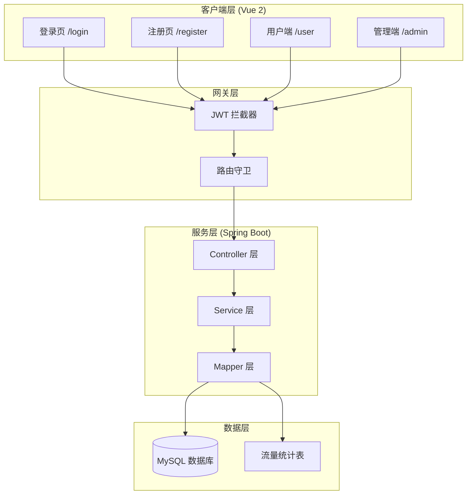

### 2.2 前端路由架构

```mermaid
graph TD
    subgraph 公开路由
        A[/login] --> B[登录页]
        C[/register] --> D[注册页]
        E[/recipe-detail] --> F[食谱详情]
        G[/health-news-detail] --> H[资讯详情]
    end

    subgraph 用户端 ["用户端 /user (role=2)"]
        I[/user] --> J[主布局]
        J --> K[/home - 首页]
        J --> L[/recipe-list - 食谱列表]
        J --> M[/health-data - 健康数据]
        J --> N[/collection-folder - 收藏夹]
        J --> O[/health-record - 健康记录]
        J --> P[/my-diet - 我的饮食]
    end

    subgraph 管理端 ["管理端 /admin (role=1)"]
        Q[/admin] --> R[管理后台布局]
        R --> S[/admin-layout - 仪表盘]
        R --> T[/user-manage - 用户管理]
        R --> U[/health-news-manage - 资讯管理]
        R --> V[/health-model-manage - 健康模组]
        R --> W[/health-record-manage - 健康记录]
        R --> X[/evaluations-manage - 评论管理]
        R --> Y[/recipe-manage - 食谱管理]
        R --> Z[/diet-history-manage - 饮食记录]
    end
```

### 2.3 后端模块架构

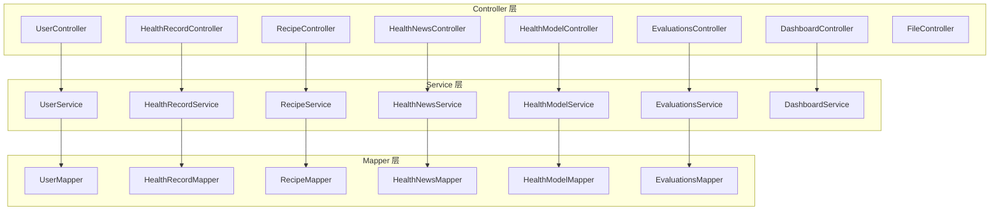

---

## 三、核心功能模块

### 3.1 用户模块

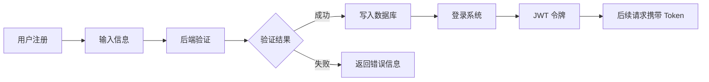

**功能**：
- 用户注册（普通用户 / 管理员）
- 用户登录（JWT 认证）
- 密码修改
- 头像上传

### 3.2 健康档案模块

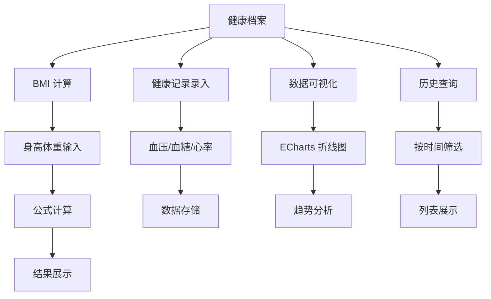

### 3.3 饮食管理模块

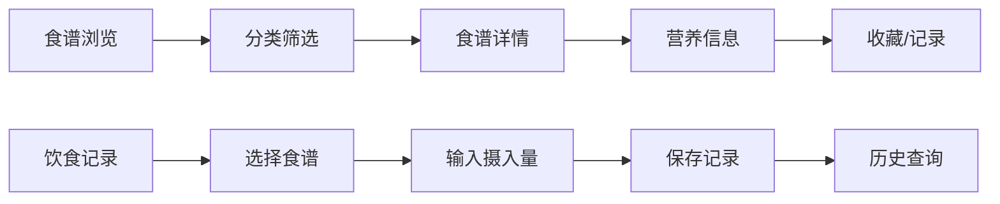

### 3.4 推荐算法模块

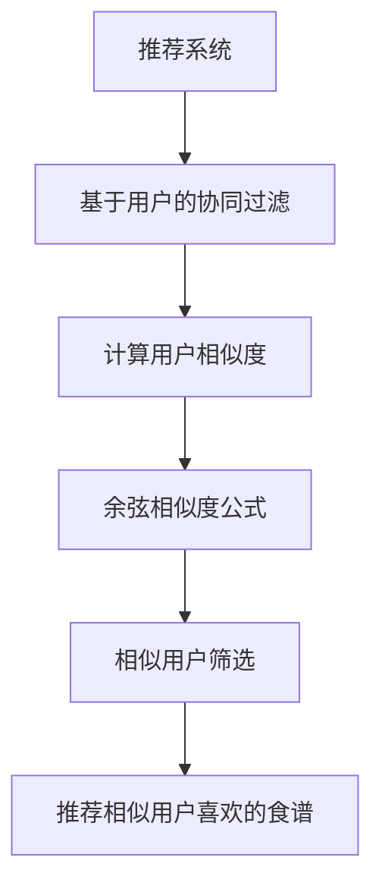

### 3.5 资讯与评论模块

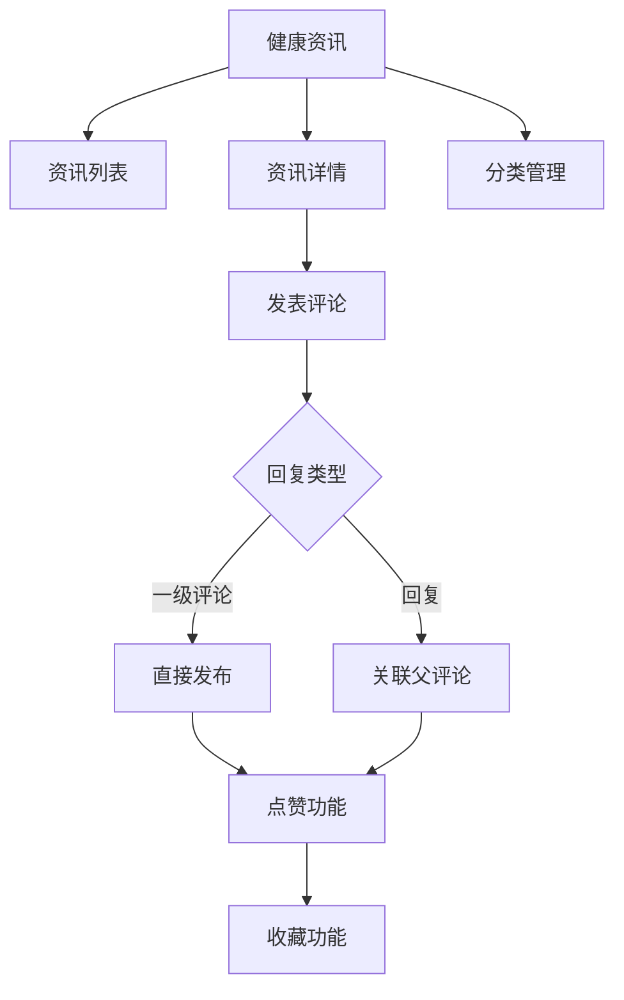

### 3.6 流量统计模块

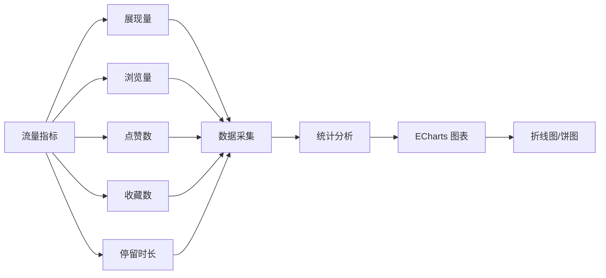

---

## 四、数据库设计

### 4.1 核心表关系

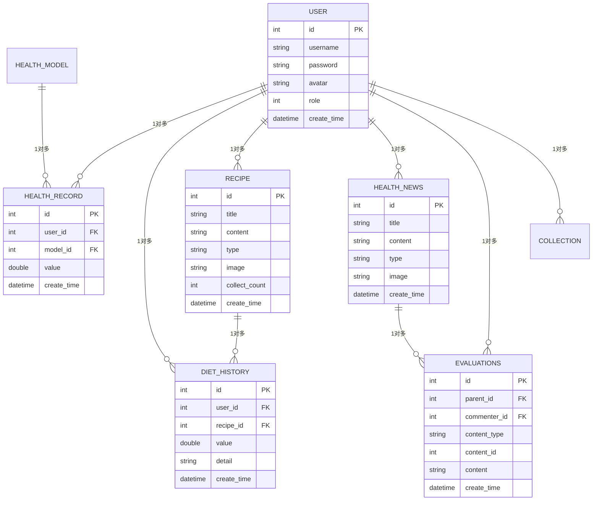

---

## 五、安全机制

### 5.1 JWT 认证流程

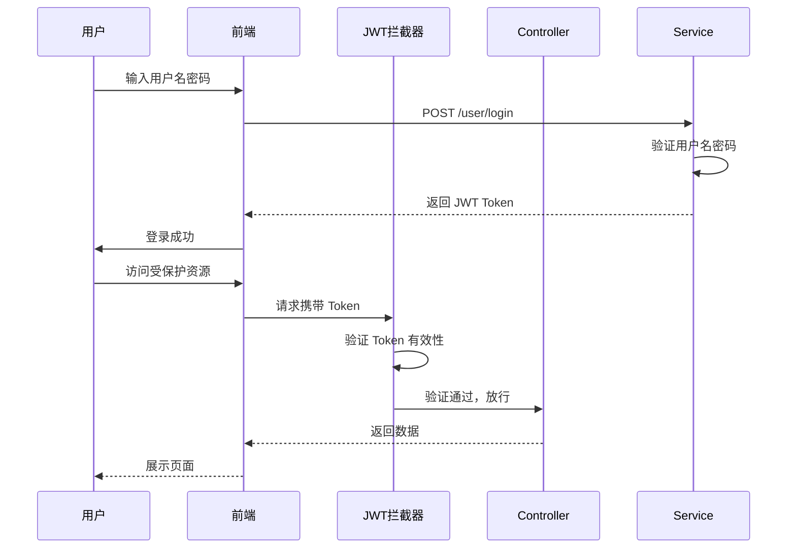

### 5.2 路由权限控制

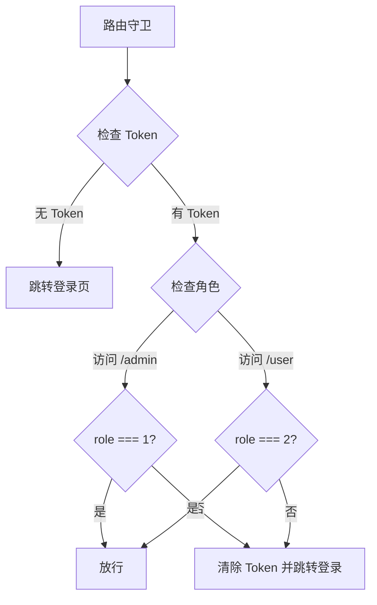

---

## 六、技术亮点

1. **前后端分离架构** - 解耦设计，独立部署
2. **JWT 无状态认证** - 支持分布式部署
3. **基于用户协同过滤推荐算法** - 个性化推荐
4. **ECharts 数据可视化** - 图表展示直观
5. **完善的权限控制** - 路由守卫 + 拦截器双重保护
6. **敏感词过滤** - Aho-Corasick 算法实现
7. **统一响应封装** - Result 统一返回格式

---

## 七、项目结构

```
self-health-system/
├── api/                    # Spring Boot 后端
│   ├── src/main/java/com/kmbeast/
│   │   ├── controller/    # 控制器
│   │   ├── service/       # 业务逻辑
│   │   ├── mapper/        # 数据访问
│   │   ├── pojo/          # 实体类
│   │   ├── utils/         # 工具类
│   │   ├── config/        # 配置类
│   │   ├── aop/           # 切面编程
│   │   └── exception/     # 异常处理
│
├── view/                   # Vue 2 前端
│   ├── src/
│   │   ├── views/         # 页面组件
│   │   │   ├── admin/     # 管理端
│   │   │   ├── user/      # 用户端
│   │   │   ├── login/     # 登录
│   │   │   └── register/ # 注册
│   │   ├── components/   # 公共组件
│   │   ├── router/        # 路由配置
│   │   ├── utils/         # 工具函数
│   │   └── assets/        # 静态资源
│   └── package.json
│
├── sql/                    # 数据库脚本
│   └── health.sql
│
└── docs/                  # 技术文档
    └── README.md
```

---

*文档版本：v1.0*  
*更新时间：2026-03-29*
