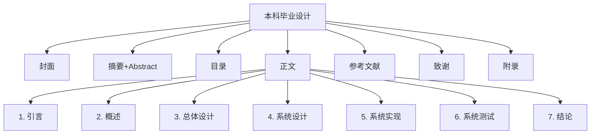
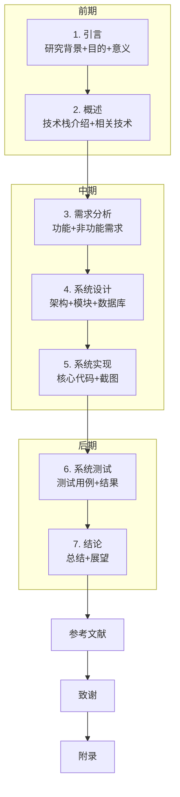
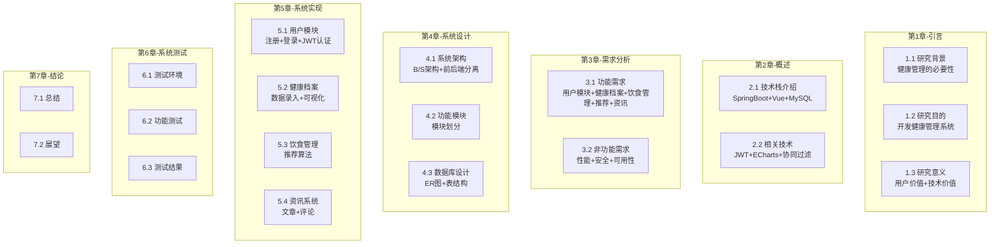
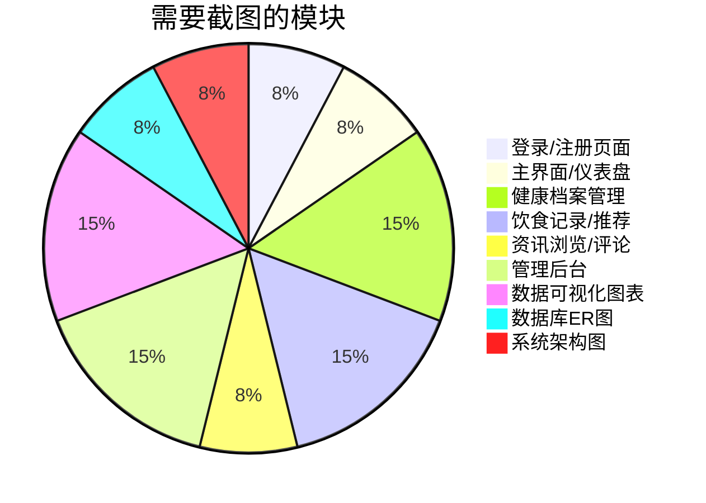
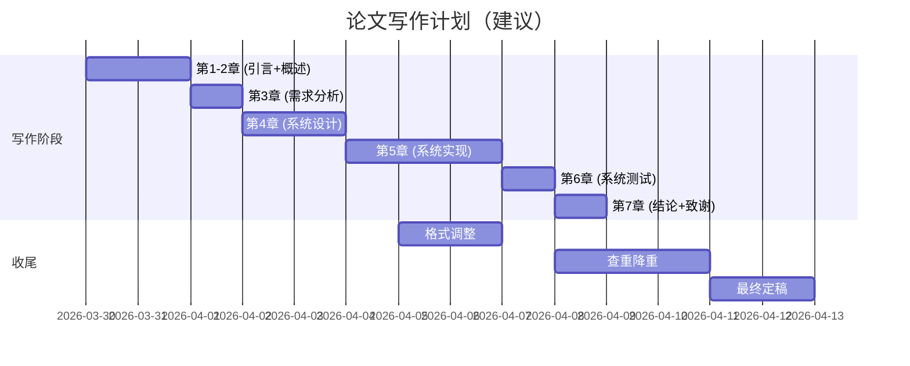

# 毕业论文写作计划

## 一、论文基本信息

| 项目 | 内容 |
|------|------|
| 题目 | SpringBoot+Vue的个人健康系统的设计与实现 |
| 学院 | 杭州电子科技大学信息工程学院 |
| 专业 | 软件工程 |
| 学生 | 梁家豪 |
| 指导教师 | 陈鑫 |

---

## 二、论文结构（基于模板）

根据学校模板，你的论文应包含以下章节：

---

## 三、章节内容规划

### 论文结构流程图

---

## 四、各章节内容规划

### 详细章节规划

---

## 五、论文与系统对应关系

| 论文章节 | 对应系统内容 |
|----------|--------------|
| 第1章 引言 | 健康管理行业背景，国内外研究现状 |
| 第2章 概述 | Spring Boot、Vue.js、MySQL 等技术介绍 |
| 第3章 需求分析 | 用户需求、功能模块划分 |
| 第4章 系统设计 | 系统架构图、数据库设计、ER图 |
| 第5章 系统实现 | 核心代码、关键实现、运行截图 |
| 第6章 系统测试 | 测试用例、测试结果 |
| 第7章 结论 | 总结工作、不足与展望 |

---

## 六、论文截图需求

---

## 七、时间安排建议

### 甘特图

---

## 八、下一步行动

> 待确认：字数要求

**确认格式和章节结构无误后，我将开始帮你撰写论文各章节内容。**

---

*文档创建时间：2026-03-29*
