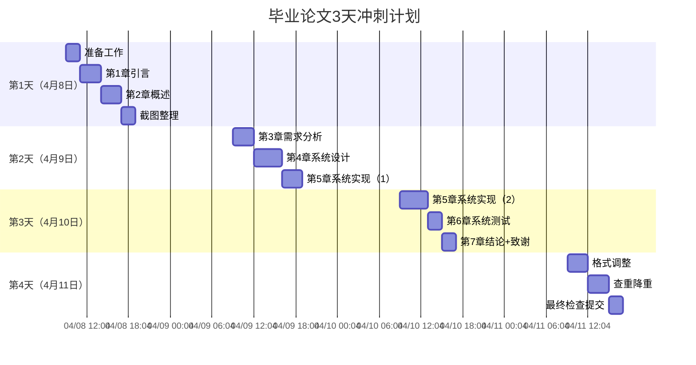

# 毕业论文冲刺计划表
**项目**: SpringBoot+Vue的个人健康系统的设计与实现  
**学生**: 梁家豪  
**导师**: 陈鑫  
**截止日期**: 2026年4月11日（本周六）  
**当前时间**: 2026年4月8日 00:53

---

## 📊 总体时间线

---

## 📅 详细任务分解

### 第1天：2026年4月8日（周三）
**目标：** 完成准备工作 + 第1-2章 + 整理系统资源

| 时间段 | 任务 | 产出 | 预估时间 |
|--------|------|------|----------|
| 09:00-11:00 | 准备工作 | - 打开毕业论文模板 - 确认字数要求 - 整理系统截图 - 准备代码片段 | 2小时 |
| 11:00-14:00 | 撰写第1章 引言 | - 1.1 研究背景（健康管理现状） - 1.2 研究目的（为什么开发） - 1.3 研究意义（用户+技术价值） | 3小时 |
| 14:00-17:00 | 撰写第2章 概述 | - 2.1 SpringBoot介绍 - 2.2 Vue.js介绍 - 2.3 MySQL介绍 - 2.4 其他技术（JWT、ECharts、协同过滤） | 3小时 |
| 17:00-19:00 | 整理系统截图 | - 按论文结构分类107张截图 - 标注截图用途 - 准备核心代码片段 | 2小时 |
| 19:00-20:00 | 休息 | - | - |
| 20:00-22:00 | 补充+优化 | - 检查第1-2章完整性 - 补充必要的图片/表格 - 生成目录 | 2小时 |

**今日关键检查点：**
- [ ] 第1章引言完成（约2000字）
- [ ] 第2章概述完成（约2500字）
- [ ] 所有截图已分类整理
- [ ] 论文框架已建立

---

### 第2天：2026年4月9日（周四）
**目标：** 完成第3-4章 + 第5章（系统实现-第1部分）

| 时间段 | 任务 | 产出 | 预估时间 |
|--------|------|------|----------|
| 09:00-12:00 | 撰写第3章 需求分析 | - 3.1 功能需求   - 用户模块（注册/登录/个人信息）   - 健康档案（数据录入/查询/可视化）   - 饮食管理（记录/推荐/统计）   - 资讯系统（浏览/评论/收藏）   - 管理后台（用户/内容/数据管理） - 3.2 非功能需求   - 性能需求   - 安全需求   - 可用性需求 | 3小时 |
| 12:00-13:00 | 休息 | - | - |
| 13:00-17:00 | 撰写第4章 系统设计 | - 4.1 系统架构   - B/S架构图   - 前后端分离架构 - 4.2 功能模块设计   - 模块划分图   - 模块详细说明 - 4.3 数据库设计   - ER图   - 核心表结构说明 | 4小时 |
| 17:00-20:00 | 撰写第5章 系统实现（1） | - 5.1 用户模块实现   - 注册登录流程   - JWT认证代码   - 运行截图（2-3张） - 5.2 健康档案模块实现   - 数据录入功能   - 数据可视化代码   - 运行截图（2-3张） | 3小时 |
| 20:00-21:00 | 休息 | - | - |
| 21:00-23:00 | 补充+优化 | - 检查第3-4章完整性 - 第5章截图插入 - 代码格式化 | 2小时 |

**今日关键检查点：**
- [ ] 第3章需求分析完成（约3000字）
- [ ] 第4章系统设计完成（约3500字）
- [ ] 第5章前两个模块完成（约2500字+6张截图）
- [ ] 累计字数：约13500字

---

### 第3天：2026年4月10日（周五）
**目标：** 完成第5章（剩余）+ 第6章 + 第7章

| 时间段 | 任务 | 产出 | 预估时间 |
|--------|------|------|----------|
| 09:00-13:00 | 撰写第5章 系统实现（2） | - 5.3 饮食管理模块实现   - 饮食记录功能   - 推荐算法代码   - 运行截图（2-3张） - 5.4 资讯系统模块实现   - 资讯浏览功能   - 评论功能代码   - 运行截图（2-3张） - 5.5 管理后台实现   - 管理功能代码   - 运行截图（3-4张） | 4小时 |
| 13:00-14:00 | 休息 | - | - |
| 14:00-16:00 | 撰写第6章 系统测试 | - 6.1 测试环境 - 6.2 功能测试   - 用户模块测试用例   - 健康档案测试用例   - 饮食管理测试用例 - 6.3 测试结果   - 测试通过率   - 性能测试数据 | 2小时 |
| 16:00-18:00 | 撰写第7章 结论+致谢 | - 7.1 结论   - 工作总结   - 系统特点   - 不足之处 - 7.2 展望   - 未来改进方向 - 致谢 | 2小时 |
| 18:00-19:00 | 休息 | - | - |
| 19:00-22:00 | 参考文献+附录 | - 整理参考文献（15-20篇） - 添加附录（核心代码/配置文件） | 3小时 |

**今日关键检查点：**
- [ ] 第5章系统实现完成（约6000字+12张截图）
- [ ] 第6章系统测试完成（约2000字）
- [ ] 第7章结论+致谢完成（约1000字）
- [ ] 参考文献整理完毕
- [ ] 累计字数：约22500字（假设总字数2.5-3万）

---

### 第4天：2026年4月11日（周六）
**目标：** 格式调整 + 查重降重 + 最终提交

| 时间段 | 任务 | 产出 | 预估时间 |
|--------|------|------|----------|
| 09:00-12:00 | 格式调整 | - 标题层级调整 - 字体字号统一 - 行间距段落间距 - 页眉页脚 - 页码设置 - 图表编号与引用 | 3小时 |
| 12:00-13:00 | 休息 | - | - |
| 13:00-16:00 | 查重降重 | - 第一次查重 - 高重复率段落标记 - 改写同义词替换 - 句式调整 - 重新查重 | 3小时 |
| 16:00-18:00 | 最终检查 | - 生成目录 - 检查图表清晰度 - 检查引用格式 - 检查页码连续性 - 导出最终版 | 2小时 |

**今日关键检查点：**
- [ ] 格式符合模板要求
- [ ] 查重率低于要求（通常<20%）
- [ ] 所有图表清晰完整
- [ ] 论文PDF版本生成
- [ ] 提交导师

---

## 📦 系统资源准备清单

### 已有资源确认

| 资源类型 | 数量 | 状态 | 需要整理 |
|---------|------|------|----------|
| 系统截图 | 107张 | ✅ 已有 | 按章节分类 |
| Java源文件 | 106个 | ✅ 已有 | 挑选核心代码 |
| Vue页面 | 27个 | ✅ 已有 | 挑选代表性页面 |
| 数据库文件 | - | ⚠️ 待确认 | 需要ER图 |

### 截图分类清单（按论文结构）

**第1-2章：** 无截图需求

**第3章需求分析：**
- [ ] 系统功能模块图（1张）

**第4章系统设计：**
- [ ] 系统架构图（1张）
- [ ] 数据库ER图（1张）
- [ ] 核心表结构截图（3-5张）

**第5章系统实现（重点）：**
- [ ] 用户模块：注册页、登录页、个人中心（3张）
- [ ] 健康档案：档案列表、数据录入、数据可视化图表（4张）
- [ ] 饮食管理：饮食记录页、推荐结果页、饮食统计图表（4张）
- [ ] 资讯系统：资讯列表页、资讯详情页、评论功能（3张）
- [ ] 管理后台：用户管理、内容管理、数据统计（3张）

**第6章系统测试：**
- [ ] 测试用例表格截图（2-3张）
- [ ] 测试结果截图（2张）

**总计需要：** 约20-25张关键截图

### 核心代码片段准备

| 模块 | 关键类/方法 | 用途 |
|------|------------|------|
| 用户模块 | JWT工具类、登录Controller | 认证机制说明 |
| 健康档案 | 健康数据Service、ECharts配置 | 数据处理+可视化 |
| 饮食管理 | 推荐算法Service、饮食Controller | 算法实现 |
| 资讯系统 | 资讯Controller、评论Service | 业务逻辑 |
| 管理后台 | 权限拦截器、数据统计Service | 管理功能 |

---

## 🎯 每日检查清单

### 第1天（4月8日）睡前检查
- [ ] 第1章引言：2000+字
- [ ] 第2章概述：2500+字
- [ ] 截图已按7章分类
- [ ] 核心代码片段已标记
- [ ] 生成目录，确认结构完整

### 第2天（4月9日）睡前检查
- [ ] 第3章需求分析：3000+字
- [ ] 第4章系统设计：3500+字
- [ ] 第5章前2个模块：2500+字+6张截图
- [ ] 累计字数：13500+字
- [ ] 所有图表已插入并编号

### 第3天（4月10日）睡前检查
- [ ] 第5章全部完成：6000+字+12张截图
- [ ] 第6章系统测试：2000+字
- [ ] 第7章结论+致谢：1000+字
- [ ] 参考文献：15-20篇
- [ ] 累计字数：22500+字（接近目标）

### 第4天（4月11日）睡前检查
- [ ] 格式符合模板要求
- [ ] 查重率达标
- [ ] 论文PDF已生成
- [ ] 已提交导师

---

## ⚠️ 重要提醒

### 时间管理
1. **严格按时间表执行**，不要拖延任何任务
2. **每2小时休息10分钟**，保持高效状态
3. **遇到卡顿立即跳过**，先完成框架再完善细节
4. **晚上23:00前必须结束当日工作**，保证睡眠

### 质量保证
1. **截图必须清晰**，分辨率不低于1920x1080
2. **代码必须可运行**，确保逻辑正确
3. **参考文献必须规范**，使用标准引用格式
4. **图表必须有编号和标题**

### 应急预案
**如果第5章系统实现（核心章节）时间不够：**
- ✅ 优先完成代码框架说明
- ✅ 每个模块至少2张截图
- ✅ 代码只展示核心方法，不要整段粘贴
- ✅ 使用图表替代部分文字说明

**如果查重率过高：**
- ✅ 同义词替换（健康管理→健康维护、推荐算法→智能推荐）
- ✅ 句式调整（主动→被动、简单→复杂）
- ✅ 增加原创内容（系统特色、创新点）
- ✅ 调整引用方式（直接引用→改写引用）

---

## 📞 联系方式

**导师信息：**
- 姓名：陈鑫
- 联系方式：[请填写导师邮箱/电话]

**紧急情况：**
- 如果遇到重大技术问题，立即联系导师
- 如果时间严重不足，优先保证第5章系统实现（最核心）

---

## ✅ 最终确认

**论文基本信息：**
- [ ] 题目：SpringBoot+Vue的个人健康系统的设计与实现
- [ ] 学院：杭州电子科技大学信息工程学院
- [ ] 专业：软件工程
- [ ] 学生：梁家豪
- [ ] 指导教师：陈鑫

**文档结构：**
- [ ] 封面
- [ ] 摘要（中文）
- [ ] Abstract（英文）
- [ ] 目录
- [ ] 正文（第1-7章）
- [ ] 参考文献
- [ ] 致谢
- [ ] 附录

**字数要求：**
- [ ] 已确认目标字数：______字
- [ ] 当前预计字数：22500-25000字
- [ ] [ ] 字数达标

---

*计划表创建时间：2026年4月8日 00:53*  
*最后更新：2026年4月8日 00:53*

**加油！你可以的！💪🔥**
